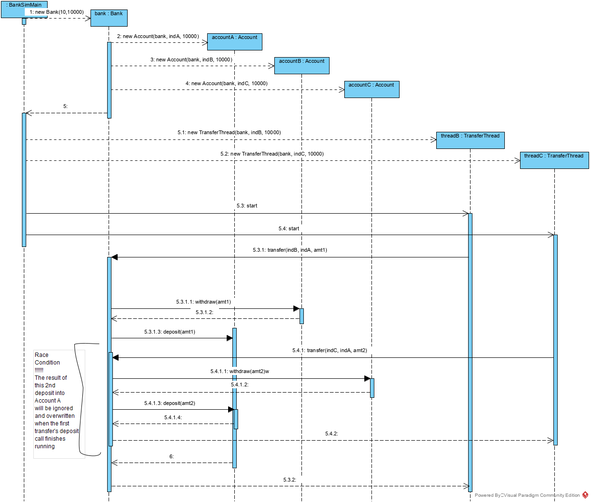
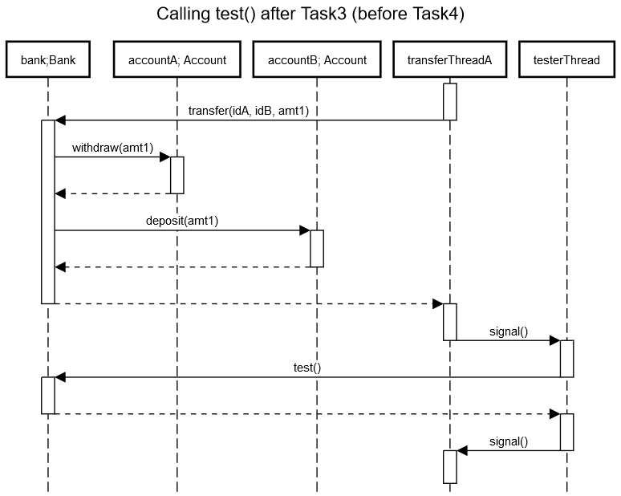

# BankSim

### Purpose
When the project is run, it will create a single "bank" along with multiple "accounts". Each of these
accounts have some balance in them and a user can interact with his/her own account by despositing money, 
withdrawing money, or displaying the balance. The primary purpose of these interactions for the project
is to allow for transfering of funds between accounts by first withdrawing a sum from one account to verify
it has the required amount, then depositing that amount into another account.

### Existing Issues In Base Version
In this version of the BankSim, there will be 10 threads, each actively transfering money to and from each other.
Since there is no scheduling mechanism currently implemented, each of these equal-priority threads will
operate in a round-robin schedule. While this doesn't inherently cause a problem, the combination of this
with simultaneous interaction with global variables causes a race condition. 

One case where a race condition occurs is when two threads interact with the same "account". For the purpose
of this explanation, accountA will be used to reference this common account. When two threads call for transfers
involving the same accountA, although the other two accounts accountB and accountC will have the proper end totals,
accountA will only reflect the results of the second thread to finish. This is because at the start of both threads,
the same initial value of accountA is used for the transfer method, which does not reflect the changes caused by the
first thread to finish for accountA; in fact the result of the first thread to finish is simply overwritten.

Of course, this example only details issues with two threads that collide. This problem will compound as more threads
run simultaneously. 

### Sequence Diagram Of Base Version Race Condition

### Race Condition Solutions For Base Version (2a)
- Synchronized Methods

Synchronized Methods are one tool used for race condition issues. If an object is visible
to more than one thread, all changes made to the object will be handled through the synchronized
method. By adding synchronization to an object, if multiple threads call the method at the same
time, only the first one will execute the method. All other methods must wait for that first
execution to complete before the next thread gets to execute the synchronized method.

- Synchronized Code Blocks

Synchronized Code Blocks also work to rectify race condition issues. Synchronized code
blocks works in a similar way to synchronized methods as the synchronized section is
only accessible and executable by one thread at a time. The primary different between
this and synchronized methods is that synchronized code blocks only locks off a small
predetermined section of a method. This is useful in cases where the method called
by the threads is immensely large, but the section in need of synchronization is small.

- ReentrantLock

Reentrant locks work in a similar manner to synchronized methods, however attempt to solve
a problem with sychronized methods: starvation. Synchronized methods do not innately have 
a queue system, so in programs with large quantities of threads, certain threads may be 
starved for resources. So rather than having a binary lock like synchronized methods do,
the reentrant lock uses an incrementing and decrementing count along with a fairness
paramenter to allocate resources. 

- Conclusion

Since the method being called by the threads is relatively small, I don't think using
synchronized code blocks is necessary as we can simply create a lock around the entire
method. That said, with an initially defined thread count of 10, starvation can potentially
become an issue, a notable downfall of synchronized methods. As a result, I believe that 
reentrant locks will be the best means of solving the race condition in the initial
BankSim build. 

### The Second Race Condition (3a)
The second race condition involves some of the transfer threads acting while another transfer thread is 
running the test() function. The test() function iterates over the array of accounts, fetching their balances
and adding them up. However, after it has fetched and summed the first several accounts' balances, one of the other 
threads might withdraw money from a later account (not yet accessed by the tester) and deposit that money into 
one of the earlier accounts (whose now-obsolete balance value had previously been read by the tester). 
Likewise, another thread might withdraw money from an earlier account (whose now-obsolete balance value had 
previously been read by the tester) and then deposit that money in a later account (whose balance hadn't yet been 
read by the tester). 
Basically, because the test function only checks an account's balance once, it's blind to changes
in the earlier accounts' balances after it had accessed them. As a result, it will sometimes incorrectly think
that money has either spontaneously disappeared from or been added to the bank.

### Defaulting On Payments (4a)
There is another issue that is not handled well in the initial implementation of the bank simulation. 
Currently whenever a transfer is started, an if check is done to see if the account being withdrawn from
has enough available funds to make the payment. If it does, the check returns true and the entire 
transaction continues as intended. However if the account does not have a sufficient balance to pay off
the transaction amount, the entire transaction is cancelled. While this does not create issues in the 
multithreading environment itself, it does a poor job of simulating bank operations. In order to better
simulate a bank setting, withdraws on accounts with insufficient balances will wait until the particular
account acquires the necessary funds to complete the transaction. This can be accomplished using 
wait() and notifyAll() methods.

- Potential Problems 

In an open system where funds could transfer outside the bank accounts into third party groups, 
there could potentially be a deadlock situation. This would occur when every thread attempts 
transfers from accounts with insufficient funds for the transfers. However since this is a closed
system and the max transfer cannot exceed the initial amount every account starts with, there will
always be at least one account with the requisite funds to complete a transfer. 

### A New Deadlock (5a)

***

## Requirements

The purpose of this lab was to fix the existing multi-threading problems and design
problems in a given bank simulation program. While there were four major problems that were 
addressed in this project, the assignment itself was broken down into five parts for
us to complete. The reason for this is to have students practice both documenting the
initial problems within the program that they were provided as well as using management tools
like Trello to document/display progress. 

For the first task, we were asked to populate this README.md file with high-level information
regarding the initial implementation of the bank simulation program. An outline of the existing
problems in this initial version were discussed and a sequence diagram demonstrating the first race
condition is also provided.

For the second task, we are asked to resolve the first race condition that occurs when two threads
would call transfers that interact with the same particular account. Since we were provided with
three different potential solutions, this task begins with research into the uses of each of these
potential solutions. After deciding on Reentrant Locks as the best options as it avoids the starvation
problem the other two solutions cause, we implement the lock around the withdraw() and deposit() 
threads. 

For the third task, we are asked to resolve a second race condition that occurs with the test function
in each of the transfer threads conflicting with one another. After detailing the issue in the above section
of this README file, we start by seperating the use of the test() method into its own thread. Within this new
testing thread, we implement Condition Variables as a means of both giving the testing thread the resources to
run and the ability to await() until when testing should be done. When it is determined to be time to test, 
a transfer thread will signal() the testing thread to run the test, which at the same time temporarily halts
all transfer threads. 

For the fourth task, we are asked to resolve a design issue in the Accounts class. With the current
implementation, any withdraw() requests to an account with insufficient funds is simply dropped. 
While this allows the program to avoid problematic instances where accounts dip into negative balances,
given that this is a simulation, it is a poor representation of how a bank should work. This task was 
started by discussing the above problem in greater detail before implementing a solution. 
 - Finish this section
 
 For the fifth task, we are asked to solve the final issue with the program, a deadlock issue that
 occurs at the end of the program runtime as a result of implementing task four. In the previous task
 we set transfers requesting an amount more than the existing balance of an account to wait until
 another transfer deposits at least the difference of the required amount into that account to continue.
 While this works fine during the runtime, when the transfer threads run near the end of their set runtime,
 a deadlock can occur if there are threads waiting for funds to continue a transfer, but all other 
 non-waiting threads have completed their run. Like the other tasks, we begin this by detailing the problem
 and potential solution above in the README before starting on the actual implementation.
  - Finish this section

## Team work

 The collaboration for this project was good. By using a mixture of texting, notes on the Trello board, and
 review notes on any github pull requests, information was clearly conveyed in an environment relevant to
 what needed to be addressed. After each task was completed, the Trello board would be updated to convey the
 information that a card has be done, and requires review. From here each task is reviewed by the other team
 member before the task is finally deemed "Done" on the Trello board.
 
 ### Contributions
 The Trello board also includes some information on this.
 #### Christopher Park
 * Created and populated Trello board
 * Wrote overview of initial implementation of project
 * Discussed issues existing in initial implementation of project
 * Detailed potential solutions for first race condition
 * Seperated the testing method into its own seperate thread
 * Explained design issues existing in current implementation of Accounts class
 * Implemented solution to design problem in Accounts class
 * Populated readme for writing requirement
 
 #### Scott Salisbury
 * Fill in here
 
 ## Testing
 
 ## UML diagrams

[Link to above UML diagram for editing](https://sequencediagram.org/index.html#initialData=C4S2BsFMAIGEENzhAOwObWJAzsAFAJTTwBmWATtACrzYDWAzNHgEaQkD25MN9ALAQBQggA7xyoAMYgxKYNBbwUdANwAhJXVHipMpfPiTJHAK5yAgiujmjpudokhpsg7bPA1Vm8fcPdLzHIlbBJIcioAC254ABNLaiCUELDI6Ji-Jz05TBwKVMhYqypc-NjhYUNQADd4LEDg0PCogriixOSmtMFgdsbS1oSGlObYgFoAPkVldU0ALh6h8jwQOIAaaBW1dfgAW2AARiEYgslq2pgFpL6Rgape4a7KkBq6qdUNZUE3meUJwx8LF43HJZgB3MARGJBUF4XYHIRPF4wf52YDxbyowQo9zo4HAUYTb4fOizQTHRHnYh43EA4DCImaP54zzWPGzY4iDjYMCwvaHLGnZ6U7FyFkY3wijxA2kEyaaH4ksknM51SVivFfeXE2WXDr9eJ3Rb9UnkwVIhRazQClUXe6dFoGu39YS665pR1Gm4TLC4B4tIolG6zbloFCIQhKil1V1+2Ieq6x9JRi65RMB3DOn15G7p4D9QmW5TzXIR002nK++2FaiBx5mykMz6Nug61NVmK542R+uvQtaZMV7NpTs3bpt-ojtLep03eN6oMhsPgUvKoXR8c5msZ0cDmPtudulrlY8noA)
